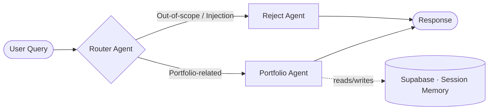

<div align="center">

# 🤖 AI Portfolio Assistant
### Multi-Agent, Zero-Hallucination Conversational AI

<p>
  
  
  
  
  
  
</p>

An enterprise-grade, autonomous AI assistant for handling professional portfolio inquiries — built on a **multi-agent semantic routing architecture** that guarantees zero hallucinations, sub-second latency, and responses grounded strictly in provided context.

</div>

---

## 📖 Overview

This project replaces a static portfolio FAQ with an intelligent conversational layer. A **supervisor (Router) agent** classifies every incoming query and dispatches it to the appropriate specialist agent — either a context-grounded portfolio responder or a zero-cost security guardrail — while a managed Postgres database preserves full conversation history across sessions.

## ✨ Key Features

- **Multi-Agent Semantic Routing** — A supervisor agent (Router) classifies user intent and routes queries to specialized worker agents.
- **Zero-Hallucination Guardrails** — A dedicated `Reject Agent` blocks prompt injections, code requests, and out-of-scope queries with zero LLM inference cost.
- **Stateful Conversation Memory** — Chat history is managed via a cloud-hosted PostgreSQL database (Supabase), keeping context intact across sessions.
- **Ultra-Fast Inference** — Powered by Meta's `Llama-3.3-70B-Versatile` via the Groq API for rapid, intelligent query resolution.

## 🏗️ Architecture



The Router Agent acts as a lightweight supervisor: it determines whether a query is genuinely about the portfolio (skills, experience, projects) or falls outside scope. In-scope queries are passed to the **Portfolio Agent**, which generates a context-grounded response and persists the exchange to Supabase. Anything else — prompt injections, code requests, irrelevant chatter — is intercepted by the **Reject Agent** before it ever reaches the LLM.

## 🧰 Tech Stack

| Layer | Technology |
| :--- | :--- |
| API Framework | FastAPI |
| LLM Orchestration | LangChain (Core & Community) |
| LLM Provider | Groq — `llama-3.3-70b-versatile` |
| Database / Memory | Supabase (PostgreSQL) via `psycopg2` |
| Data Validation | Pydantic |

## 📂 Project Structure

```text
.
├── agents/
│   ├── router_agent.py      # Semantic intent classifier (Supervisor)
│   ├── portfolio_agent.py   # RAG/context-driven response worker
│   └── reject_agent.py      # Zero-latency security guardrail
├── core/
│   ├── config.py            # Centralized environment & LLM configuration
│   └── state.py             # PostgreSQL session history manager
├── data/
│   └── profile_data.json    # Knowledge base: skills, experience, projects
├── main.py                  # FastAPI entry point & API routes
├── requirements.txt         # Project dependencies
└── .env                      # Environment variables (ignored in Git)
```

## 🚀 Getting Started

### 1. Clone the repository

```bash
git clone https://github.com/Zishan-AI-Eng/Personal-AI-Assitant.git
cd Personal-AI-Assitant
```

### 2. Install dependencies

```bash
pip install -r requirements.txt
```

### 3. Configure environment variables

Create a `.env` file in the root directory with the following:

```env
GROQ_API_KEY=your_groq_api_key
DATABASE_URL=postgresql://postgres:[PASSWORD]@[YOUR-SUPABASE-URL]:5432/postgres
```

### 4. Run the API server

```bash
uvicorn main:app --reload
```

The API will be available at `http://127.0.0.1:8000`.

## 📡 API Reference

**Endpoint:** `POST /chat`

**Request Body:**

```json
{
  "session_id": "user-unique-id-123",
  "message": "Tell me about Zeeshan's experience with Agentic AI."
}
```

**Response:** Returns a context-grounded reply generated by the Portfolio Agent, with conversation history persisted against the provided `session_id`.

## 🗺️ Roadmap

- [ ] Streaming responses via Server-Sent Events (SSE)
- [ ] Multi-language support (Urdu/English)
- [ ] Embeddable chat widget for portfolio frontend
- [ ] Observability with OpenTelemetry tracing

## 👨‍💻 Author

**Zeeshan Khan**
AI Engineer & Solution Architect — specializing in Agentic AI, autonomous workflows, and applied deep learning.

[](mailto:zishan.ai.engineer@gmail.com)
[](https://linkedin.com/in/zishan-ai-engineer/)
[](https://marwatportfolio-eight.vercel.app/)

## 📄 License

This project is licensed under the MIT License. See the `LICENSE` file for details.